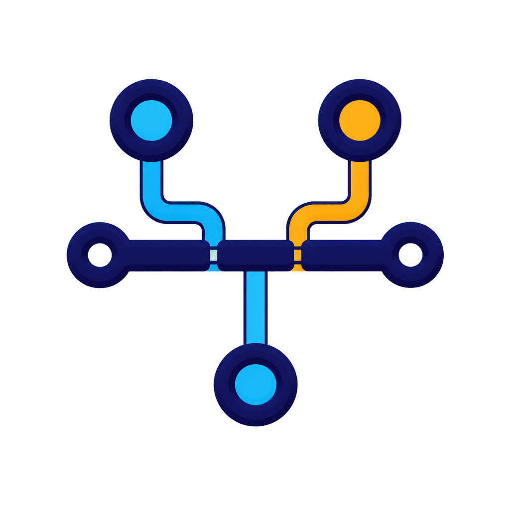
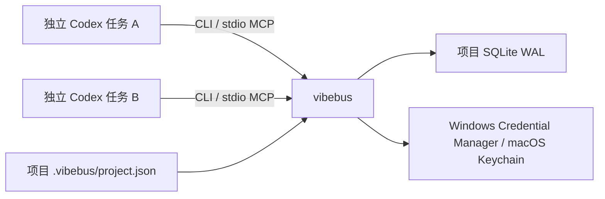

# VibeBus



VibeBus 是面向独立 Codex 顶层任务的本地结构化事实总线。它保留每个任务的聊天上下文与 worktree 隔离，只共享明确登记的消息、ACK、任务状态、依赖、已确认决策、路径租约和产物引用。

VibeBus 0.10 可在 Windows 与 macOS 原生运行，并提供 Linux `amd64` 容器路径。Rust 单文件程序同时提供 CLI、stdio MCP 和 macOS 原生 Hook 入口，状态写入项目级 SQLite WAL；Agent 与 operator 秘密分别位于 Windows Credential Manager 或 macOS Keychain。Codex 插件、Hook、marketplace、Windows MSI、macOS ARM64 本地包和独立插件包均有仓库内交付路径。

当前 G1 冻结的唯一生产候选是 **Windows x64 的签名 GitHub Release `v0.10.0`**。macOS 仅保留本地开发/验收包，Linux 容器仅保留受控交付路径；二者均不在本次正式发布范围内。

## 5 分钟上手

### Windows 插件安装

在干净源码 checkout 中构建插件后，启动新的 Codex 任务加载 Skill、MCP 和 Hook。`plugins/vibebus/bin/vibebus.exe` 是构建产物，绝不随源码提交：

```powershell
powershell -File .\scripts\package-plugin.ps1
codex plugin marketplace add .
codex plugin add vibebus@vibebus-local
```

首次安装或 Hook 定义变更后，必须在 Codex 中审查并信任 Hooks。然后在预期项目根目录显式初始化，并注册当前任务：

```powershell
vibebus.exe init --root D:\path\to\repo --name "My Project"
vibebus.exe register --root D:\path\to\repo --name api --role backend --store-credentials
vibebus.exe credential status --root D:\path\to\repo --agent api
vibebus.exe inbox --root D:\path\to\repo --agent api
```

领取任务前检查责任策略，为真正要编辑的精确项目相对路径建立 reservation；需要跨域时由任务所有者签发限时 override。完成后用结构化 handoff 交接，并对需要确认的消息执行 read → ACK → close。

### macOS 插件安装

Apple Silicon 本地开发与验收入口：

```sh
./scripts/package-plugin-macos.sh
codex plugin marketplace add \
  "$PWD/dist/staging/VibeBus-0.10.0-macos-arm64"
codex plugin add vibebus@vibebus-local
./plugins/vibebus/bin/vibebus --root "$PWD" \
  register --name mac-worker --role implementation --store-credentials
./plugins/vibebus/bin/vibebus --root "$PWD" \
  credential status --agent mac-worker
```

安装或 Hook 变更后启动新的 Codex 任务并审查/信任 Hooks。macOS 使用 Keychain，成功存储后同样返回 `secretsRedacted=true`。完整环境、验收、运行目录和生产签名边界见 [macOS 开发与本地交付](docs/macos.md)。

### Linux 容器

容器是无 HTTP 端口的命令式 CLI/std io MCP 服务，多阶段构建、非 root 运行，项目挂载到 `/workspace`，SQLite 数据放在独立 `/data` volume：

```powershell
./scripts/test-container.ps1 -ImageTag vibebus:0.10.0-local
docker run --rm `
  --mount type=bind,source=D:\path\to\repo,target=/workspace `
  --mount type=volume,source=vibebus-data,target=/data `
  vibebus:0.10.0-local doctor --root /workspace
```

运行用户为 `10001:10001`。Linux 没有 Windows Credential Manager，不能使用 `--store-credentials`；请用短时显式 token 或 `VIBEBUS_AGENT_TOKEN` 注入，且不要把任何 token、恢复密钥、operator、ACR、云或签名凭据放进镜像、Dockerfile、构建参数、仓库或报告。阿里云 ACR 登录/推送/manifest digest 验证见[容器交付](docs/container.md)。

## 已实现与边界

- Agent 注册、单次 recovery key、bearer token 轮换、Windows Credential Manager/macOS Keychain 和成功写入后的秘密脱敏。
- 定向消息、未读 Inbox、read/ACK/close、带依赖任务、原子领取、乐观版本冲突和 Codex task/thread 绑定。
- 项目相对路径 reservation、严格责任域、任务作用域限时 override、产物登记和 SHA-256 校验。
- 不可变 Git commit/test 事实、确认决策、任务作用域 context sync、幂等键和 replay-safe subscription peek/ACK。
- 高优先级结构化 handoff、review-only proposal、SQLite health/backup、CLI-only 离线压缩、Windows/macOS/Linux CI、MSI、macOS 本地包、便携包和独立插件包。
- GitHub Actions SHA 固定、`cargo deny` 漏洞/许可证/来源门禁，以及 CycloneDX SBOM 候选证据；Windows tag 发布同时携带 `supply-chain-evidence.json`。

VibeBus 共享结构化事实，不共享整段聊天或隐藏推理；不承诺远程多主机同步、强制中断/唤醒正在生成的模型、自动 Git 合并/冲突解决、自动生产签名或已完成的远程发布。PostToolUse 只记录有界事实，Stop 只保存待审阅提案。

## 架构边界



没有常驻 HTTP daemon。每次 CLI/MCP 调用都打开同一个项目数据库；事务、唯一约束、乐观版本、busy timeout 和 TTL reservation 构成协调边界。默认数据库在 Windows `%LOCALAPPDATA%\VibeBus\projects\<project-id>\vibebus.db` 或 macOS `~/Library/Application Support/dev.VibeBus.VibeBus/projects/<project-id>/vibebus.db`，不进入仓库。

## 安全模型

- token 与 recovery key 只在注册、恢复或轮换边界返回明文；SQLite 仅保存 SHA-256 摘要，凭据库成功写入后响应脱敏。
- Inbox 必须使用收件人身份认证；reservation 不替代 task ownership，override 不绕过 reservation 冲突。
- operator 初始化、轮换、恢复、删除和 retention 批准只允许真实交互式 CLI，MCP 不提供 operator mutation。
- `maintenance compact --backup <new-path>` 还要求真实终端输入 `compact:<project-id>`、vault-backed Operator、零活动任务/绑定/reservation、独占 SQLite 边界和足够空间；它先创建并验证新备份，且不通过 MCP 暴露。
- replay-safe delivery 是至少一次交付，副作用必须幂等；需要 ACK 的消息不得先 close。
- Hook 不读取 transcript、diff 或原始测试日志；插件不创建、打开、唤醒或控制原生 Codex 任务。

## 构建、开发和验收

仓库锁定 Rust 1.97.1。Windows 本地入口：

```powershell
cargo fmt --all -- --check
cargo test --all-targets --locked
cargo clippy --all-targets --all-features --locked -- -D warnings
cargo install cargo-deny --version 0.20.2 --locked
cargo install cargo-cyclonedx --version 0.5.9 --locked
cargo deny check advisories bans licenses sources
cargo cyclonedx --format json
./scripts/test-lifecycle-hooks.ps1
./scripts/validate-plugin.ps1 -PluginRoot ./plugins/vibebus
./scripts/build-release.ps1
$msi = Get-ChildItem ./dist/VibeBus-*-windows-x64.msi | Select-Object -First 1
./scripts/test-installer.ps1 -MsiPath $msi.FullName
./scripts/test-container.ps1 -ImageTag vibebus:0.10.0-local
git diff --check
```

macOS 本地入口：

```sh
cargo fmt --all -- --check
cargo test --all-targets --locked
cargo clippy --all-targets --all-features --locked -- -D warnings
./scripts/test-lifecycle-hooks.sh
./scripts/test-macos-keychain.sh
./scripts/package-plugin-macos.sh
git diff --check
```

普通 PR 的本地 release 包明确是未签名验收包；生产 tag 路径在缺少 PFX Base64 与密码时失败关闭，不会伪造已签名生产发布。MSI 不通过自定义操作修改 Codex 配置，安装后仍需显式注册 marketplace。生产下载验收必须覆盖签名、校验和、安装、可选升级、卸载、用户 `PATH` 与 marketplace 清理。

## 文档入口

- [架构](docs/architecture.md)
- [CLI 与 MCP 协议](docs/protocol.md)
- [验收记录](docs/acceptance.md)
- [企划差距分析](docs/plan-gap-analysis.md)
- [发布工程](docs/release.md)
- [容器交付](docs/container.md)
- [macOS 开发与本地交付](docs/macos.md)
- [备份、导出与恢复演练](docs/backup-restore.md)
- [双顶层任务桌面验收](docs/desktop-acceptance.md)
- [安全策略与漏洞报告](SECURITY.md)
- [后续接手](docs/HANDOFF.md)
- [插件 README](plugins/vibebus/README.md)

许可证：MIT。
