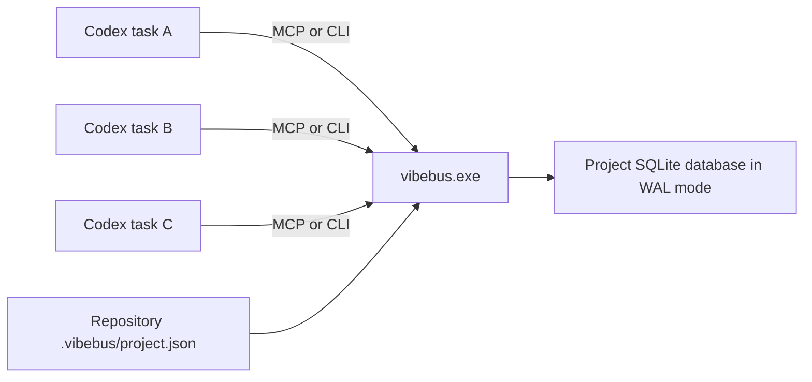

# VibeBus architecture

## Goal

VibeBus coordinates independent Codex top-level tasks without collapsing their chat or worktree isolation. The shared layer contains durable facts only: recoverable agent identities, directed messages, receipts, tasks, dependencies, reservations, artifacts, subscriptions, and audit events.

## Runtime shape



There is no resident HTTP daemon. Each CLI call or MCP process opens the same project database. SQLite `BEGIN IMMEDIATE`, unique constraints, optimistic versions, and a busy timeout provide the coordination boundary.

## Project identity and storage

The repository marker is intentionally small and commit-friendly:

```json
{
  "projectId": "prj_...",
  "name": "Example",
  "createdAt": "...",
  "schemaVersion": 1
}
```

The database is outside the repository by default:

```text
%LOCALAPPDATA%\VibeBus\projects\<project-id>\vibebus.db
```

`VIBEBUS_DATA_HOME` or `--data-home` can override the base directory for testing and controlled deployments.

## Data model

| Table | Purpose |
| --- | --- |
| `projects` | Resolved project identity and root |
| `agents` | Names, roles, bearer/recovery hashes, token generation, liveness timestamps |
| `messages` | Directed structured facts |
| `message_receipts` | Per-recipient delivered/read/ACK state |
| `tasks` | Owner, state, version, blocker, timestamps |
| `task_dependencies` | Prerequisite edges |
| `reservations` | TTL-backed path intent |
| `artifacts` | File path, hash, summary, task relation, metadata |
| `idempotency_records` | Operation-scoped request hashes and cached responses |
| `subscriptions` | Agent-owned filters, committed cursors, pending deliveries, and last-ACK state |
| `events` | Append-only audit facts |
| `schema_migrations` | Applied database schema versions |

## Invariants

1. A message appears only in explicitly named recipient inboxes.
2. Exactly one concurrent claimant can own a claimable task.
3. A task update requires both the owner identity and current version.
4. Dependency completion changes eligible pending tasks to ready.
5. Terminal tasks cannot return to active states.
6. Exclusive overlapping reservations owned by different agents conflict.
7. Reservation paths cannot escape the project syntactically.
8. Artifact paths must resolve to existing files inside the canonical project root.
9. Backup creation never overwrites an existing destination.
10. Successful agent recovery rotates both the bearer token and single-use recovery key.
11. An idempotency key either returns its original response or conflicts on payload drift.
12. A subscription has at most one pending replay-safe delivery; its committed cursor moves only after matching ACK.
13. Structured handoffs are directed, high-priority, and marked as requiring acknowledgement.
14. Legacy consume-on-poll cannot advance through an unacknowledged replay-safe delivery.

## Recovery and retry boundaries

Bearer tokens and recovery keys are generated from independent random UUID material and stored only as SHA-256 digests. Recovery is a credential rotation, not an identity recreation: task ownership, messages, subscriptions, reservations, and artifacts remain attached to the same agent row. A legacy agent can provision its first recovery key using its still-valid bearer token.

Externally retried writes record a canonical JSON request hash and serialized response in the same `BEGIN IMMEDIATE` transaction as the domain mutation. This prevents the common ambiguous-result retry from creating duplicate messages, leases, renewals, or artifacts. Records are deliberately scoped by operation so unrelated APIs may reuse a caller's key.

## Event consumption

Every domain mutation appends a project event in the same transaction. The integer `sequence` is the canonical ordering cursor. Direct event queries are stateless and replayable from a caller-retained cursor.

Named subscriptions keep an authenticated agent-owned committed cursor in SQLite. Replay-safe peek writes one pending delivery range without moving that cursor; repeated peeks reconstruct the same immutable event range. ACK atomically moves the cursor, records the most recent acknowledged delivery for retry recovery, and clears pending state. Cursor bookkeeping deliberately does not append another event, avoiding an infinite self-notification loop for wildcard subscriptions.

Legacy polling still consumes and commits in one call, but it conflicts whenever pending delivery state exists. Future retention must never delete events inside any pending delivery range. Critical payloads such as handoffs remain independently durable in the directed inbox, so event delivery is notification/indexing state rather than the sole copy of work instructions.

## Codex plugin lifecycle

The plugin contains:

- `.mcp.json`, which launches the packaged native executable with `mcp`;
- `skills/vibebus-coordination/SKILL.md`, which defines the coordination discipline;
- `hooks/hooks.json`, which runs a read-only Windows SessionStart discovery script.

The MCP process starts from the installed plugin directory. For that reason every MCP tool accepts a `root` argument; the Skill requires an absolute project root on every call.

## Deliberate non-goals for 0.2

- sharing entire chat transcripts;
- injecting messages into an already-running model generation;
- replacing Codex tasks, worktrees, or native subagents;
- remote multi-host synchronization;
- automatic Git merging or conflict resolution;
- holding secrets in repository files.
- exactly-once consumer side effects; replay-safe delivery is at-least-once until ACK;
- automatic secure credential-vault integration or cross-device credential recovery.
