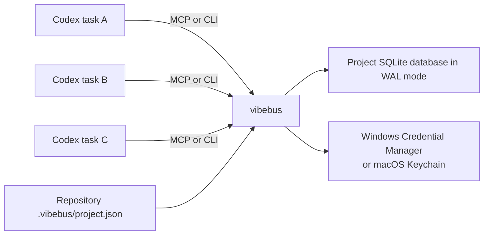

# VibeBus architecture

## Goal

VibeBus coordinates independent Codex top-level tasks without collapsing their chat or worktree isolation. The shared layer contains durable facts only: recoverable agent identities, directed messages, receipts, tasks, task/thread associations, dependencies, responsibility overrides, reservations, artifacts, confirmed decisions, Git/test facts, subscriptions, and audit events.

## Runtime shape



There is no resident HTTP daemon. Each CLI call or MCP process opens the same project database. SQLite `BEGIN IMMEDIATE`, unique constraints, optimistic versions, and a busy timeout provide the coordination boundary.

## Project identity and storage

The repository marker is intentionally small and commit-friendly:

```json
{
  "projectId": "prj_...",
  "name": "Example",
  "createdAt": "...",
  "schemaVersion": 1
}
```

The database is outside the repository by default:

```text
%LOCALAPPDATA%\VibeBus\projects\<project-id>\vibebus.db
~/Library/Application Support/dev.VibeBus.VibeBus/projects/<project-id>/vibebus.db
```

`VIBEBUS_DATA_HOME` or `--data-home` can override the base directory for testing and controlled deployments.

Bearer and recovery secrets remain outside this database. When storage is explicitly requested, Windows Credential Manager or macOS Keychain receives one current-user entry per project/Agent target:

```text
VibeBus:<project-id>:<agent-name>
```

Destructive maintenance uses a distinct project operator target:

```text
VibeBusOperator:<project-id>
```

The operator is intentionally not an Agent role. Its CLI-only interactive capability approves a single exact retention plan for a short window and directly authorizes an explicitly confirmed offline compaction. MCP can plan and apply logical retention but cannot initialize, rotate, restore, delete, approve, or compact.

The serialized secret pair includes a format version and token generation. On Windows it stays below the 2,560-byte Generic Credential BLOB limit, and `CRED_PERSIST_LOCAL_MACHINE` makes it available to later local logon sessions of the same Windows user. On macOS it is a generic-password value stored by Security.framework under account `VibeBus`. Neither backend makes credentials available to other users or machines.

## Data model

| Table | Purpose |
| --- | --- |
| `projects` | Resolved project identity and root |
| `agents` | Names, roles, bearer/recovery hashes, token generation, liveness timestamps |
| `messages` | Directed structured facts |
| `message_receipts` | Per-recipient delivered/read/ACK/closed state |
| `tasks` | Owner, state, version, blocker, timestamps |
| `task_dependencies` | Prerequisite edges |
| `task_thread_bindings` | Historical task-to-Codex-thread associations and unbind time |
| `reservations` | TTL-backed path intent with optional task association |
| `responsibility_overrides` | Expiring owner-issued task/path authorization for one grantee |
| `artifacts` | File path, hash, summary, task relation, metadata |
| `decisions` | Immutable task-scoped confirmed facts, semantic keys, artifact references, and author/timestamp evidence |
| `git_commit_facts` | Immutable task/commit association, bounded changed paths, author, and summary |
| `test_result_facts` | Immutable task/result-key association, outcome, bounded command/summary, and optional report artifact |
| `idempotency_records` | Operation-scoped request hashes and cached responses |
| `subscriptions` | Agent-owned filters, committed cursors, pending deliveries, and last-ACK state |
| `events` | Append-only audit facts |
| `retention_state` | Retained event-history floor and latest applied plan |
| `retention_runs` | Retry-safe immutable cleanup reports keyed by confirmation plan |
| `operator_credentials` | Project operator secret digest, generation, and rotation timestamps |
| `retention_approvals` | Short-lived plan approvals, generation binding, and atomic consumption audit |
| `schema_migrations` | Applied database schema versions |

## Invariants

1. A message appears only in explicitly named recipient inboxes.
2. Exactly one concurrent claimant can own a claimable task.
3. A task update requires both the owner identity and current version.
4. Dependency completion changes eligible pending tasks to ready.
5. Terminal tasks cannot return to active states.
6. Exclusive overlapping reservations owned by different agents conflict.
7. Reservation paths cannot escape the project syntactically.
8. Artifact paths must resolve to existing files inside the canonical project root.
9. Backup creation never overwrites an existing destination.
10. Successful agent recovery rotates both the bearer token and single-use recovery key.
11. An idempotency key either returns its original response or conflicts on payload drift.
12. A subscription has at most one pending replay-safe delivery; its committed cursor moves only after matching ACK.
13. Structured handoffs are directed, high-priority, and marked as requiring acknowledgement.
14. Legacy consume-on-poll cannot advance through an unacknowledged replay-safe delivery.
15. A message requiring acknowledgement cannot be closed before the recipient ACKs it.
16. Closed messages are immutable receipt history and are hidden from the normal inbox.
17. A task has at most one active Codex-thread binding, managed only by its task owner.
18. Completed or abandoned tasks have no active thread binding; terminal transition ends it atomically.
19. Event retention deletes only a contiguous prefix older than policy, below the slowest subscription cursor, and outside the configured recent tail.
20. A pending subscription delivery is protected because its committed cursor cannot advance until matching ACK.
21. Retention apply requires an unchanged preview plan; the same confirmed plan can be retried without deleting twice.
22. Closed messages cannot expire before message idempotency responses that may still reference them.
23. A credential target is scoped by both project ID and validated Agent name, so identities with the same name in different projects do not collide.
24. A successful stored-secret delivery omits bearer and recovery values; a failed post-rotation write returns the only usable pair with an explicit storage error instead of stranding the identity.
25. Explicit token input wins over environment input, which wins over current-user vault fallback; recovery-key fallback comes only from the matching vault entry.
26. Operator mutation is CLI-only, requires a real terminal plus exact typed confirmation, and has no MCP tool.
27. A new retention run requires one unexpired, unconsumed approval for the exact plan and current operator generation.
28. Approval consumption, retention deletion, audit append, and immutable report storage commit atomically; a completed retry needs no second approval.
29. A confirmed-decision key identifies one immutable semantic payload project-wide; exact retries return that fact and payload drift conflicts.
30. Only the owner of a non-terminal task may confirm a decision for it, and referenced task-scoped artifacts cannot belong to another task.
31. Agent context sync contains only active owned tasks, their direct dependencies, unread directed messages, artifacts related to that scope, and confirmed decisions related to that scope.
32. Context pagination uses deterministic fact keys rather than database offsets; every returned page obeys both its item limit and serialized-item byte budget.
33. A configured responsibility policy is strict and fail-closed; an absent policy preserves the pre-0.10 allow-all behavior for existing projects.
34. Task-scoped reservations, task artifact declarations, and Git changed-path facts must match the authenticated Agent's role or one active task-scoped override.
35. Only the non-terminal task owner may grant an authenticated 60–86,400-second responsibility override; it never bypasses reservation overlap or task ownership.
36. A task/commit SHA and a task/test-result key each identify one immutable semantic payload; exact retries replay and drift conflicts.
37. Lifecycle Hooks never treat shell output, transcripts, diffs, or logs as durable fact payloads; unknown exit status is skipped instead of guessed.
38. Stop generates a bounded proposal only. Sending a handoff remains an explicit authenticated action.
39. Offline compaction is CLI-only, starts before normal `Bus::open`, requires `compact:<project-id>` plus the vault-backed Operator secret, and refuses non-terminal tasks, active bindings, active reservations, a busy SQLite boundary, an existing backup path, an unverified backup, or insufficient database-volume free space.
40. Compaction creates and verifies a consistent backup before `VACUUM`, retains an exclusive lock while switching WAL to DELETE, restores and checkpoints WAL afterward, verifies integrity/foreign keys/schema, and appends bounded start/completion audit events without exposing an Operator secret.

## Recovery and retry boundaries

Bearer tokens and recovery keys are generated from independent random UUID material and stored in SQLite only as SHA-256 digests. Recovery is a credential rotation, not an identity recreation: task ownership, messages, subscriptions, reservations, and artifacts remain attached to the same agent row. A legacy agent can provision its first recovery key using its still-valid bearer token.

The credential-vault layer is outside the domain transaction. Register, recover, and provision first commit the authoritative digest state, then write the returned pair to the OS vault. On success, the response is redacted. If that second write fails, suppressing the secrets would make the newly committed identity unrecoverable, so the response deliberately falls back to the plaintext pair plus `credentialStorageError` and `secretsRedacted=false`. When recovery or provisioning itself used a vault secret, the rotated pair is automatically written back so the single-use recovery key cannot become stale.

The Windows backend calls `CredWriteW`, `CredReadW`, `CredDeleteW`, and `CredFree` directly. The macOS backend uses Security.framework generic-password set/get/delete operations, maps missing items to normal absent status, and suppresses interactive authentication UI so a CLI, MCP server, or Hook fails closed instead of hanging when its code signature is not authorized for an older item. Unit tests inject an in-memory implementation; the repository macOS acceptance fixture separately creates and removes a disposable real Keychain entry. The vault is an at-rest and accidental-disclosure boundary, not a sandbox between processes already running as the same OS user.

Operator initialization and rotation use the same digest-first/vault-second recovery rule as Agent credentials. Successful storage redacts the operator secret. If the vault write fails after the authoritative generation changes, the interactive response exposes the only usable secret once with an explicit error. `operator restore-credential` accepts that secret through a no-echo TTY prompt, verifies it against the database digest, and repairs the separate vault entry. An operator rotation invalidates every outstanding approval from the previous generation without deleting its audit record. Explicit `operator delete-credential` removes only the current-user vault entry after a real-terminal `delete:<project-id>` confirmation. It deliberately preserves the database digest and generation, causing `ready=false`; this supports verifiable disposable-project cleanup without adding a remote or MCP deletion capability.

Externally retried writes record a canonical JSON request hash and serialized response in the same `BEGIN IMMEDIATE` transaction as the domain mutation. This prevents the common ambiguous-result retry from creating duplicate messages, leases, renewals, artifacts, or decisions. Records are deliberately scoped by operation so unrelated APIs may reuse a caller's key. Confirmed decisions retain a second durable semantic-deduplication boundary through their unique project/key pair even after the generic idempotency record expires. After an explicitly configured idempotency retention window expires, the historical request-key guarantee for other operations also expires; the cleanup plan reports how many records are affected.

## Agent context projection

`context sync` is the authenticated task-specific read model. It starts from the Agent's active owned tasks, expands exactly one dependency edge, and then selects unread directed messages plus artifacts, immutable confirmed decisions, Git commit facts, and test-result facts associated with that task scope. It never returns unrelated tasks, project-global event history, artifact metadata blobs, artifact file contents, diffs, or test logs. ACKed, read, or closed messages leave the default projection because their receipt state remains durable outside the context page.

Every projected fact has a deterministic category/order key. The continuation cursor encodes the last emitted key, so static pagination does not repeat or skip facts and does not depend on a mutable SQL offset. Concurrent state changes can add or remove later facts; callers should restart from the beginning when they require a fresh atomic view rather than treating a cursor as a database snapshot.

The caller supplies item and serialized-item byte budgets. Task descriptions, blockers, message bodies, and artifact summaries are bounded previews with explicit truncation flags. Decision summaries are bounded at confirmation time, while long evidence stays behind artifact ID/path/hash references. The response reports exact item bytes consumed, whether more facts remain, and the next cursor only when continuation is required.

## Event consumption

Every domain mutation appends a project event in the same transaction. The integer `sequence` is the canonical ordering cursor. Direct event queries are stateless and replayable from a caller-retained cursor.

Named subscriptions keep an authenticated agent-owned committed cursor in SQLite. Replay-safe peek writes one pending delivery range without moving that cursor; repeated peeks reconstruct the same immutable event range. ACK atomically moves the cursor, records the most recent acknowledged delivery for retry recovery, and clears pending state. Cursor bookkeeping deliberately does not append another event, avoiding an infinite self-notification loop for wildcard subscriptions.

Legacy polling still consumes and commits in one call, but it conflicts whenever pending delivery state exists. Future retention must never delete events inside any pending delivery range. Critical payloads such as handoffs remain independently durable in the directed inbox, so event delivery is notification/indexing state rather than the sole copy of work instructions.

## Message and task/thread lifecycles

Message closing is a recipient-owned terminal receipt action. Closing also records read state. Messages marked `requiresAck` must have an ACK first; a successful close is retry-safe and appends exactly one `message_closed` event. The default inbox excludes closed messages, while explicit history reads can include them.

A task owner may bind a non-terminal task to one caller-supplied Codex task/thread identifier. Repeating the same bind or unbind returns the original binding state; attempting a second active identifier conflicts. VibeBus stores only the association—it does not invoke Codex thread APIs. Moving a task to `completed` or `abandoned` atomically closes its active binding, so resume snapshots cannot advertise stale execution ownership.

## Bounded retention

Retention is an explicit three-gate operation. An authenticated Agent preview calculates cutoffs and exact candidate counts, then hashes the policy, current event tail, subscription protection boundary, retained-history floor, and candidates into a `planId`. A local operator reviews and interactively authorizes that exact ID for 60–3,600 seconds. Apply opens `BEGIN IMMEDIATE`, recomputes the plan, requires an active approval at the current operator generation, and refuses stale or unapproved work before deletion. Approval bookkeeping deliberately does not append a domain event because that would invalidate its own plan.

The accepted approval is consumed in the same transaction as deletion, the `retention_applied` event, and the immutable run report. Concurrent attempts serialize; after one commits, another sees and replays the stored report. This ambiguous-result recovery path does not require a second approval and cannot execute the deletion twice.

Events are pruned only as a contiguous prefix. The planned boundary is the minimum of the age boundary, the slowest committed subscription cursor, and the sequence immediately before the configured recent-event tail. A subscription with cursor `0` therefore blocks event deletion; an unacknowledged pending delivery keeps the same protection until ACK. Each successful cleanup appends a new `retention_applied` audit event after deletion and advances a persistent history floor. Event queries or deliberate subscription replays older than that floor conflict instead of silently returning incomplete history; compact handoff snapshots clamp to the available floor.

Other cleanup domains are independent and age-bounded: idempotency records, closed per-recipient receipts, messages left with no receipts, and unbound history for terminal tasks. Active messages, active task bindings, non-terminal task history, subscriptions, tasks, artifacts, confirmed decisions, agents, reservations, retention reports, and schema records are not removed. Logical retention never runs `VACUUM` automatically; physical compaction is the separately confirmed offline operation below.

## Offline compaction

`maintenance compact --backup <new-path>` is intentionally absent from MCP and handled before the normal connection/migration path. The maintainer must stop every CLI, MCP, Hook, and Codex task for the project, use a real terminal to type `compact:<project-id>`, and have the current Operator credential in the platform vault. The core then opens the existing database read/write without creating or migrating it, sets zero busy timeout, checkpoints WAL, retains an exclusive lock, switches to DELETE journaling, verifies current schema/project/Operator identity, and refuses any non-terminal task, active task binding, or unexpired reservation.

Before `VACUUM`, VibeBus creates a new non-overwriting SQLite backup, verifies its integrity, foreign keys, schema, and project identity, and requires at least twice the current database size free beside the live database. It records a bounded start event, runs `VACUUM` under the exclusive boundary, restores WAL, records completion, checkpoints, and returns before/after file hashes, sizes, page/freelist counts, reclaimed bytes, backup identity, Operator generation, and final verification. On failure after the journal switch it best-effort restores WAL; the verified backup remains the recovery boundary. Repository acceptance invokes the core only against disposable project/data directories, never the live coordination database.

## Codex plugin lifecycle

The plugin contains:

- `.mcp.json`, which launches the packaged native executable with `mcp`;
- `skills/vibebus-coordination/SKILL.md`, which defines the coordination discipline;
- `hooks/hooks.json`, which runs PowerShell implementations on Windows and native-binary SessionStart/PostToolUse/Stop implementations on macOS/Unix.

The MCP process starts from the installed plugin directory. For that reason every MCP tool accepts a `root` argument; the Skill requires an absolute project root on every call. Hook commands receive `PLUGIN_ROOT` and writable `PLUGIN_DATA`, require Codex trust review, and run at the session working directory. PostToolUse resolves only an active task/thread binding, reliable exit metadata, commit identity/subject/path names, and a hashed working state; Stop calls the bounded proposal read model and writes it under plugin data. Neither Hook reads the unstable transcript format, and Stop emits no continuation or automatic message mutation.

## Release supply chain

Rust 1.97.1 and Cargo.lock define the native build inputs. A repository-owned PowerShell path packages Windows, validates the manifest/MCP/Hook/Skill contract, and uses pinned WiX 4.0.6 to produce a per-user x64 MSI. The macOS path builds a native host-architecture Mach-O, applies an ad-hoc local signature, stages a macOS MCP payload, validates it, and emits portable/plugin archives plus checksums and a manifest. Developer ID signing, hardened runtime, notarization, and downloaded-artifact Gatekeeper acceptance remain explicit production gates.

Pull-request CI has read-only repository permission and produces explicitly unsigned, short-lived acceptance artifacts. It runs stock MSI validation except the irrelevant per-machine-only ICE91 rule, creates an administrative image, verifies the expected payload and binary version, and cleans the image.

Production release automation is tag-gated and fail-closed. An existing `vX.Y.Z` tag must match Cargo and plugin versions. SignTool signs and verifies the binary before staging and the MSI after construction using SHA-256 and an RFC 3161 timestamp. Checksums are calculated only after signing. A job-scoped `GITHUB_TOKEN` with `contents: write` publishes assets; signing material remains only in repository or protected-environment Secrets.

## Deliberate non-goals for 0.10

- sharing entire chat transcripts;
- injecting messages into an already-running model generation;
- replacing Codex tasks, worktrees, or native subagents;
- remote multi-host synchronization;
- automatic Git merging or conflict resolution;
- holding secrets in repository files;
- exactly-once consumer side effects; replay-safe delivery is at-least-once until ACK;
- Linux secure-vault backends or cross-device credential recovery;
- protection against a malicious process already running as the same OS user;
- hardware-backed or remote multi-party operator approval; the current gate is a local human-presence and accidental-automation boundary;
- automatic creation of release tags or unsigned production releases;
- installer custom actions that silently mutate Codex plugin configuration;
- bit-for-bit reproducible MSI/ZIP output or private-repository attestations on an ineligible GitHub plan.
